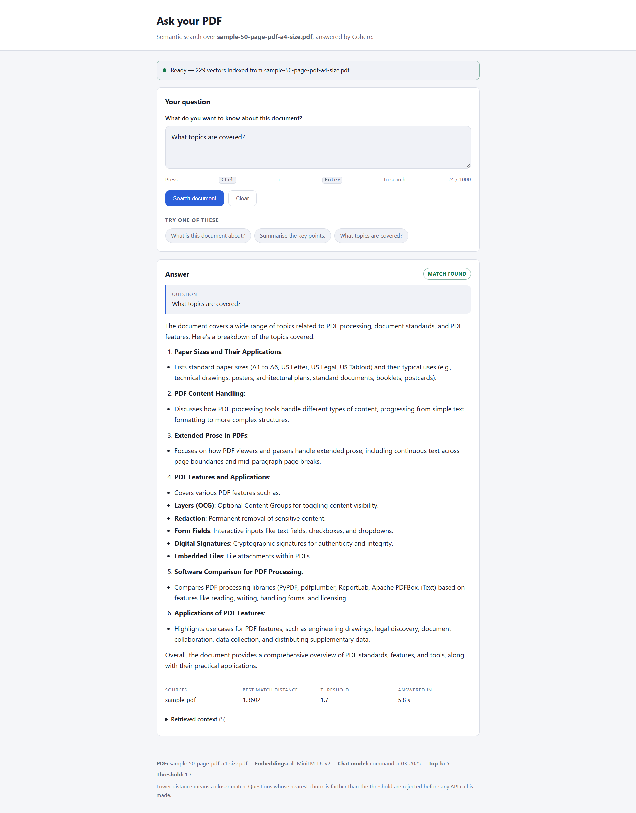

# PDF RAG — FAISS + Cohere (no LangChain chains)

Ask questions about a PDF. The script chunks the PDF, embeds the chunks locally
with a sentence-transformer model, stores the vectors in a FAISS index, then
answers questions by retrieving the closest chunks and passing them to Cohere.

Two front ends share that one pipeline: a CLI (`chat_loa.py`) and a browser UI
(`app.py`, Flask).

LangChain is used only for PDF loading and text splitting — there are no chains,
retrievers, or agents.

## Files

| File | Purpose |
| --- | --- |
| `chat_loa.py` | The pipeline and CLI. |
| `app.py` | Flask web UI — browser search page over the same pipeline. |
| `templates/index.html` | The search page. |
| `static/css/styles.css` | Page styling. |
| `static/js/app.js` | Form handling, loader, result rendering. |
| `config.py` | Every tunable setting. Reads overrides from `.env`. |
| `env.example` | Template for `.env`. Copy it, don't edit it in place. |
| `.env` | Your secrets and overrides. Git-ignored. You create this. |
| `requirements.txt` | Dependencies. |
| `docs/screenshots/` | UI reference images used by this README. |
| `Vector_Store/` | Generated index + chunk table. Git-ignored. |
| `chat_loa_notebook.ipynb` | The original notebook this was converted from. |

## Requirements

- Python 3.12 or newer (floor set by the pinned `numpy==2.5.3`; verified on 3.14)
- A Cohere API key — get one at [dashboard.cohere.com/api-keys](https://dashboard.cohere.com/api-keys)
- Roughly 2 GB of disk for the install (`sentence-transformers` pulls in PyTorch)

## Setup

### 1. Install dependencies

```powershell
cd <project-folder>
python -m pip install -r requirements.txt
```

A virtual environment is recommended so PyTorch doesn't land in your global
site-packages:

```powershell
python -m venv .venv
.\.venv\Scripts\Activate.ps1
python -m pip install -r requirements.txt
```

If PowerShell blocks the activate script, allow it for the current session:

```powershell
Set-ExecutionPolicy -Scope Process -ExecutionPolicy RemoteSigned
```

### 2. Create your `.env`

```powershell
Copy-Item env.example .env
```

Open `.env` and set your key:

```ini
COHERE_API_KEY=your-real-key-here
```

`.env` is git-ignored. Never commit it, and don't put the key in `config.py`.

### 3. Copy in your PDF and point the config at it

Copy the PDF you want to query into the project folder (the same folder as
`chat_loa.py`):

```powershell
Copy-Item "C:\path\to\your\document.pdf" .
```

Then update the filename in `.env` so it matches exactly:

```ini
PDF_PATH=document.pdf
```

Notes on this step:

- The name is case-sensitive on some filesystems and must include the `.pdf`
  extension. A mismatch produces `Error: PDF not found: ...` with the full path
  it tried, so compare that against `Get-ChildItem *.pdf`.
- A relative name is resolved against the project folder. You can also leave the
  PDF where it is and give an absolute path instead:
  `PDF_PATH=C:\Users\you\Documents\document.pdf`
- If the path has spaces, write it bare — no quotes: `PDF_PATH=My Report.pdf`
- `env.example` ships the default `PDF_PATH=Rhea_resume.pdf`, which is *not*
  included here. Change it, or the build fails with `PDF not found`. The folder
  currently contains `sample-50-page-pdf-a4-size.pdf` if you want something to
  try first.
- Also update `DOCUMENT_SOURCE` in `.env` — that string is what gets printed
  under "Sources" for every answer, so set it to your document's origin
  (a URL, a filename, a system name, whatever is meaningful).
- The PDF must contain a real text layer. Scanned or image-only PDFs extract
  nothing and fail with `No extractable text found`. Run them through OCR first.

### 4. Build the index

```powershell
python chat_loa.py build
```

First run downloads the embedding model (~90 MB for `all-MiniLM-L6-v2`), so give
it a minute. On success you get the vector count and the two output paths. This
writes `Vector_Store/vector_db.index` and `Vector_Store/docs.csv`.

### 5. Ask questions

```powershell
python chat_loa.py chat
```

## Usage

```
python chat_loa.py build                        # (re)build the index from the configured PDF
python chat_loa.py ask "what is this document about?"   # one question, then exit
python chat_loa.py chat                         # interactive loop
python chat_loa.py chat --rebuild               # rebuild, then chat
python chat_loa.py ask "..." --rebuild          # rebuild, then answer
python chat_loa.py --help                       # full CLI help
```

Running with no subcommand defaults to `chat`. In the interactive loop, type
`exit` or `quit` (or press Ctrl+C) to leave.

## Web UI

Same pipeline, in a browser. Build the index first (step 4 above), then:

```powershell
python app.py
```

Open <http://127.0.0.1:5000>. Type a question, press **Search document** (or
<kbd>Ctrl</kbd>+<kbd>Enter</kbd>), and a spinner runs until the answer comes
back.

 The result panel shows the answer, its sources, the nearest-chunk
distance, the threshold it was compared against, the wall-clock time, and a
collapsible **Retrieved context** section with the exact chunks that were fed
to Cohere.

A banner at the top reports whether the vector store loaded, and how many
vectors it holds. If the index is missing or `COHERE_API_KEY` is unset, that
banner tells you so and the search button stays disabled — you get the real
reason in the page instead of a stack trace.

Flags:

```powershell
python app.py --port 8000     # different port
python app.py --debug         # Flask reloader + debugger
python app.py --host 0.0.0.0  # expose on your network (see the warning below)
```

The first search of each run loads the embedding model, so it takes a few extra
seconds. After that the model, index, and Cohere client are cached for the life
of the process.

### Security

**These endpoints have no authentication.** Anyone who can reach the port can
query your indexed document and spend your Cohere credits. The default binding
is `127.0.0.1`, which accepts connections only from your own machine — keep it
that way unless you put your own auth or a reverse proxy in front. `--host
0.0.0.0` opens the app to every machine on your network and prints a warning.

`app.run()` is Flask's development server. It is single-process and not hardened
for public traffic; use a production WSGI server (waitress, gunicorn) behind
real auth if you ever need to deploy this.

Requests are capped at a 64 KB body and 1000 characters per question. Answers
are rendered from a small, deliberately limited markdown subset applied *after*
HTML-escaping, so neither your input nor the model's output can inject markup.

### HTTP API

The page is a thin client over two JSON endpoints, usable on their own:

| Endpoint | Method | Returns |
| --- | --- | --- |
| `/api/status` | GET | `{ready, settings}` — `200` when the pipeline loaded, `503` with an `error` when it didn't. |
| `/api/ask` | POST | The answer object below. `400` on empty or over-long input, `503` if the pipeline can't load, `502` if retrieval or Cohere fails. |

```powershell
$body = @{ question = "what is this document about?" } | ConvertTo-Json
Invoke-RestMethod -Uri http://127.0.0.1:5000/api/ask -Method POST `
  -ContentType "application/json" -Body $body
```

```jsonc
{
  "question":   "what is this document about?",
  "answered":   true,          // false when the distance gate rejected it
  "answer":     "This document is ...",
  "sources":    ["sample-pdf"],
  "scores":     [0.9243, 0.9636, 0.9873, 1.0299, 1.0431],
  "best_score": 0.9243,        // compared against threshold
  "threshold":  1.7,
  "chunks":     ["...", "..."] // empty when rejected
}
```

A rejected question returns HTTP `200` with `answered: false` and the
`IRRELEVANT_QUERY_MESSAGE` as the answer — it's a valid result, not an error,
and no Cohere call is made. The UI labels it **No relevant match**.

This is the same dict `chat_loa.answer_query()` returns, so the CLI and the web
UI can't drift apart.

### Swapping to a different PDF

Re-run steps 3 and 4 — copy the new file in, change `PDF_PATH`, then rebuild.
The rebuild overwrites the previous index, so one PDF is active at a time. The
shortcut is `python chat_loa.py chat --rebuild` after editing `.env`.

Forgetting to rebuild is the most common mistake: you'll get confident answers
sourced from the *old* document.

## Sample output

```
> python chat_loa.py ask "what is the PDF version history?"
Loading embedding model: all-MiniLM-L6-v2
Distance score: [[0.7403685  0.76700425 0.7795146  0.84155285 0.8511428 ]]

Bot Response:
The PDF version history reflects the evolution of the Portable Document
Format from its inception as a proprietary Adobe format to its current
status as an open international standard. ...

Sources:
['sample-pdf']
```

If the closest chunk is farther than `DISTANCE_THRESHOLD`, no Cohere call is
made and you get `Please ask a relevant question.` instead. That's the relevance
gate working, not an error.

### Calibrating `DISTANCE_THRESHOLD`

The inherited default of `1.7` is permissive. On a 50-page test PDF, on-topic
questions scored around 0.74–0.92 and deliberate nonsense still scored about
1.53 — under the threshold, so it got passed to Cohere anyway. The model then
said the document doesn't cover it, which works, but costs an API call.

Use the printed distance scores to tune it: ask a few good questions and a few
off-topic ones, then set the threshold between the two clusters. Around `1.2`
is a reasonable starting point for `all-MiniLM-L6-v2`. No rebuild needed, and
you can try a value for one run without editing `.env`:

```powershell
$env:DISTANCE_THRESHOLD="1.2"; python chat_loa.py ask "your question"
```

Environment variables set in the shell take precedence over `.env`.

## Configuration reference

Every value below can be set in `.env`. Defaults live in `config.py` and are
used when a variable is absent or blank.

| Variable | Default | What it does |
| --- | --- | --- |
| `COHERE_API_KEY` | *(none — required)* | Your Cohere key. The script exits with a clear message if unset. |
| `PDF_PATH` | `Rhea_resume.pdf` | PDF to index. Relative to the project folder, or absolute. |
| `DOCUMENT_SOURCE` | `www.rheadata.com` | Citation label attached to every chunk. |
| `VECTOR_STORE_DIR` | `Vector_Store` | Where the index and chunk table are written. |
| `INDEX_FILENAME` | `vector_db.index` | FAISS index filename. |
| `DOCS_FILENAME` | `docs.csv` | Chunk table filename. |
| `CHUNK_SIZE` | `500` | Characters per chunk. Larger means more context per hit, fewer hits. |
| `CHUNK_OVERLAP` | `100` | Character overlap between neighbouring chunks, so sentences aren't cut mid-thought. |
| `EMBEDDING_MODEL_NAME` | `all-MiniLM-L6-v2` | Any [sentence-transformers](https://www.sbert.net/docs/pretrained_models.html) model. Changing it requires a rebuild. |
| `TOP_K` | `5` | Chunks retrieved per question. Clamped down if the index holds fewer. |
| `DISTANCE_THRESHOLD` | `1.7` | Max L2 distance for the nearest chunk. Lower is stricter. |
| `COHERE_CHAT_MODEL` | `command-a-03-2025` | Cohere chat model. |
| `COHERE_TEMPERATURE` | `0.3` | Higher is more creative, lower is more literal. |
| `PROMPT_TEMPLATE` | see `config.py` | Must keep the `{context}` and `{question}` placeholders. |
| `IRRELEVANT_QUERY_MESSAGE` | `Please ask a relevant question.` | Shown when the threshold rejects a question. |

Changing `CHUNK_SIZE`, `CHUNK_OVERLAP`, or `EMBEDDING_MODEL_NAME` invalidates the
existing index — rebuild after editing any of them. The retrieval and Cohere
settings take effect immediately, no rebuild needed.

## Troubleshooting

**`Error: COHERE_API_KEY is not set.`**
No `.env`, or the key line is missing or blank. Confirm the file is named exactly
`.env` (Windows Explorer likes to append `.txt`) and sits beside `chat_loa.py`.
Check with `Get-ChildItem -Force .env`.

**`Error: PDF not found: <path>`**
`PDF_PATH` doesn't match a real file. The message shows the exact path tried —
compare it to `Get-ChildItem *.pdf`. Watch for a missing `.pdf` extension or a
typo in the name.

**`Error: No extractable text found in <path>`**
The PDF has no text layer, i.e. it's a scan or export of images. OCR it first
(Acrobat, `ocrmypdf`, or similar) and rebuild.

**``Error: Vector store missing in <dir>. Run `python chat_loa.py build` first.``**
You went straight to `ask`/`chat`. Run `build` once.

**Every question returns "Please ask a relevant question."**
The nearest chunk exceeds `DISTANCE_THRESHOLD`. Either the question genuinely
isn't covered by the document, or the threshold is too tight for your content.
The printed distance scores tell you which — raise `DISTANCE_THRESHOLD` in `.env`
to just above the typical first score if good questions are being rejected.

**Answers reference the wrong document.**
You changed `PDF_PATH` without rebuilding. Run `python chat_loa.py build`.

**First run hangs with no output.**
It's downloading the embedding model from Hugging Face. Subsequent runs read it
from the local cache and start fast.

**Cohere 401 / unauthorized.**
Bad or expired key. Regenerate it in the Cohere dashboard and update `.env`.

**Web UI: `ModuleNotFoundError: No module named 'flask'`.**
Install from the updated requirements: `python -m pip install -r requirements.txt`.

**Web UI: the top banner is red.**
It prints the same message the CLI would. Missing index means run
`python chat_loa.py build`; missing key means fix `.env`. Reload the page after
correcting it — the pipeline is cached per process, so a failed load isn't
retried silently.

**Web UI: `Address already in use` / port 5000 taken.**
Something else holds the port (on macOS it's often AirPlay). Use
`python app.py --port 8000`.

**Web UI: first search feels slow, later ones are fast.**
Expected. The embedding model loads on the first request only.

**Web UI: the spinner stays up after the answer appears.**
Fixed — see `docs/screenshots/web-ui-loader-stuck-bug.png` for what it looked
like. The JS shows and hides panels with the `hidden` attribute, and the
browser's `[hidden] { display: none }` is a *user-agent* rule, so any
author-level `display` declaration (`.loader` and `.banner` both use
`display: flex`) silently outranked it. `styles.css` now re-asserts
`[hidden] { display: none !important; }` in author origin. If you add a
component with its own `display` that the JS toggles, that one rule is what
keeps it working — don't remove it.

**Web UI: a hard refresh shows old behaviour.**
Browsers cache `styles.css` and `app.js`. Reload with <kbd>Ctrl</kbd>+<kbd>F5</kbd>,
or run `python app.py --debug`, which disables static caching.

**Warnings on startup.**
Three are expected and harmless:

- `langchain-community is being sunset` — only `PyPDFLoader` is used from it.
- `huggingface_hub cache-system uses symlinks ... your machine does not support
  them` — Windows without Developer Mode. Costs some disk, nothing else.
- `You are sending unauthenticated requests to the HF Hub` — only affects
  download rate limits on the one-time model fetch.

Silence them all with `python chat_loa.py ask "..." 2>$null`, which routes
stderr away while keeping the answer on stdout.

## How it works

```
PDF ──PyPDFLoader──> pages
    ──RecursiveCharacterTextSplitter──> chunks (500 chars, 100 overlap)
    ──SentenceTransformer──> vectors
    ──faiss.IndexFlatL2──> Vector_Store/vector_db.index
                           Vector_Store/docs.csv  (chunk text + source)

question ──SentenceTransformer──> vector
         ──index.search(k=5)──> distances + chunk ids
         ──distance gate (> 1.7 → reject)
         ──chunks joined into prompt──> Cohere chat ──> answer + sources

CLI       chat_loa.main ─┐
                         ├─> chat_loa.answer_query() ──> result dict
Web UI    app.py /api/ask┘                               (answer, sources,
                                                          scores, chunks)
```

`IndexFlatL2` is an exact, brute-force L2 index. It's the right choice at this
scale — no training, no approximation, no tuning. For very large corpora you'd
move to an approximate index such as `IndexIVFFlat`.
